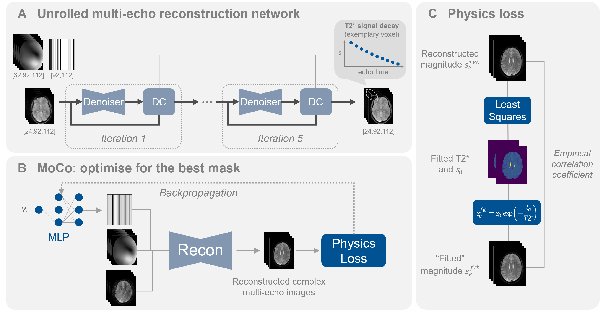

# PHIMO: Physics-Informed Deep Learning for Motion-Corrected Reconstruction of Quantitative Brain MRI

**Hannah Eichhorn**, Veronika Spieker, Kerstin Hammernik, Elisa Saks, Kilian Weiss, Christine Preibisch, Julia A. Schnabel

Accepted at [MICCAI 2024](https://papers.miccai.org/miccai-2024/608-Paper1914.html) | [Link to paper](https://link.springer.com/chapter/10.1007/978-3-031-72104-5_54)


**Abstract:** 
We propose PHIMO, a physics-informed learning-based motion
correction method tailored to quantitative MRI. PHIMO leverages
information from the signal evolution to exclude motion-corrupted
k-space lines from a data-consistent reconstruction. We demonstrate the
potential of PHIMO for the application of T2* quantification from gradient
echo MRI, which is particularly sensitive to motion due to its sensitivity
to magnetic field inhomogeneities. A state-of-the-art technique for
motion correction requires redundant acquisition of the k-space center,
prolonging the acquisition.We show that PHIMO can detect and exclude
intra-scan motion events and, thus, correct for severe motion artifacts.
PHIMO approaches the performance of the state-of-the-art motion correction
method, while substantially reducing the acquisition time by over
40%, facilitating clinical applicability.

**Keywords:** Self-Supervised Learning · Motion Detection · Data-Consistent
Reconstruction · T2* Quantification · Gradient Echo MRI


## Citation
If you use this code, please cite our arXiv paper:

```
@InProceedings{eichhorn2024,
author="Eichhorn, Hannah and Spieker, Veronika and Hammernik, Kerstin and Saks, Elisa and Weiss, Kilian and Preibisch, Christine and Schnabel, Julia A.",
editor="Linguraru, Marius George and Dou, Qi and Feragen, Aasa and Giannarou, Stamatia and Glocker, Ben and Lekadir, Karim and Schnabel, Julia A.",
title="Physics-Informed Deep Learning for Motion-Corrected Reconstruction of Quantitative Brain MRI",
booktitle="Medical Image Computing and Computer Assisted Intervention -- MICCAI 2024",
year="2024",
publisher="Springer Nature Switzerland",
address="Cham",
pages="562--571",
isbn="978-3-031-72104-5"
}
```

## Contents of this repository:

- `iml-dl`: code belonging to the above work, using an adapted version of the [IML-CompAI Framework](https://github.com/compai-lab/iml-dl) and the [MERLIN Framework](https://github.com/midas-tum/merlin). The weights of the trained models are not shared, since the training was performed on private data.

All computations were performed using Python 3.8.12 and PyTorch 2.0.1.


## Setup:

1. Create a virtual environment with the required packages:
    ```
    cd ${TARGET_DIR}/PHIMO
    conda env create -f conda_environment.yml
    source activate phimo *or* conda activate phimo
    ```

2. Install pytorch with cuda:
    ```
    conda install pytorch torchvision torchaudio pytorch-cuda=11.7 -c pytorch -c nvidia
    pip install torchinfo
    conda install -c conda-forge pytorch-lightning
    ```

3. For setting up wandb please refer to the [IML-CompAI Framework](https://github.com/compai-lab/iml-dl).


## Steps to reproduce the analysis:

1) Use the file `iml-dl/projects/recon_t2star/preprocessing/create_symbolic_links.py` to create symbolic links under `iml-dl/data/links_to_data/` (folders need to be adapted here).

2) Adapt `iml-dl/projects/recon_t2star/configs/config_train_random_masks.yaml` and `ismrm-abstract/iml-dl/projects/recon_t2star/configs/config_train_var_dens_masks.yaml` to correct settings (i.e. input and output folders) for training the unrolled reconstruction network on random masks for PHIMO and variable density masks for OR-BA 

3) Run the following commands for training the reconstruction networks:
      ```
      # go to right directory and activate the conda environment
      cd path_to_code/PHIMO/preprint/iml-dl
      conda activate phimo

      # launch the experiment
      echo 'Starting Script'
      python -u ./core/Main.py --config_path ./projects/recon_t2star/configs/config_train_{random_masks or var_dens_masks}.yaml
      ```

4) Adapt `iml-dl/projects/moco_t2star/configs/config_test_moco.yaml` to correct settings (i.e. input and output folders) for optimising the line detection MLP. 

5) Run the following commands for optimising the MLP (motion detection and correction):
      ```
      # go to right directory and activate the conda environment
      cd path_to_code/PHIMO/preprint/iml-dl
      conda activate phimo

      # launch the experiment
      echo 'Starting Script'
      python -u ./core/Main.py --config_path ./projects/moco_t2star/configs/config_test_moco.yaml
      ```
      Note: this needs to be run for each subject separately. Please exchange the `select_one_scan` variable in the config file for that.

6) For the evaluation of results and creation of plots for the preprint, adapt the config file `iml-dl/projects/moco_t2star/configs/config_evaluate_moco.yaml` and run `iml-dl/projects/moco_t2star/evaluate_predictions.py`


## Illustration of PHIMO:

Overview of PHIMO. (A) Training an unrolled reconstruction network on randomly
undersampled motion-free multi-echo images. (B) MoCo of motion-corrupted
data by optimising an MLP to predict slice-wise exclusion masks in a self-supervised
fashion for each subject individually. (C) Calculation of empirical correlation coefficient
as physics-informed loss for optimising the MLP in (B).
